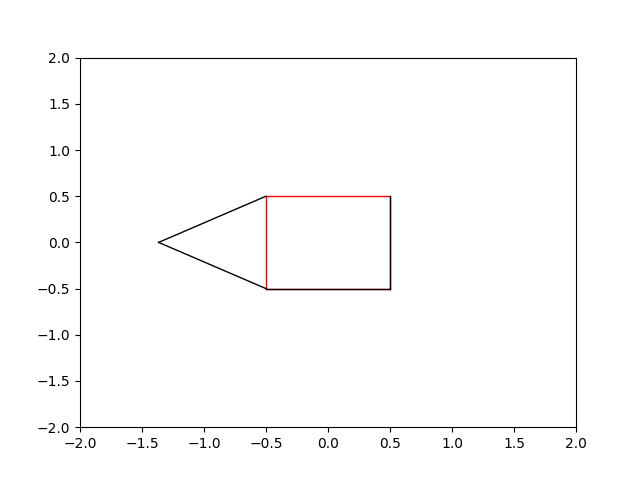

# Matchstick Triangles

This little project is inspired by problem #60 "Matchstick Squares"
from the book _Ingenious Mathematical Problems & Methods_, which is
a collection of puzzles submitted by applied mathematicians to the
column _The Graham Dial_.

The idea is that you have a box of identical matchsticks, and
you first use them to construct a square. Then the challenge is to
find the fewest number of matches required to construct a
triangle on each face of the square, such that the triangle on
each face is different from all the others.

I didn't have anything at hand that would serve as identical
matchsticks, so I thought it could be fun to try to animate the
setup with Python and Matplotlib. Here is the result of that
first attempt:

	

The independent variable here is the angle $\theta$ between the left
side of the square and the matchstick that is attached to the upper
left corner. All the other matchstick positions are determined
by that angle and the requirements that they touch end to end
and each touch one corner of the square.

**Angle of symmetry:**

I became curious about the angle $\theta$ that makes the diagram
symmetrical. I was able to work out that it should satisfy

$$\frac{1}{2} = (1 - 2\sin(\theta / 2))\cdot \cos(\theta / 2) = \cos(\theta / 2) - \sin(\theta).$$

I didn't immediately see a way to solve this using trig identities,
so I made a small program `find_angle.py` to solve the equation
numerically using SciPy's `fsolve`. This produced the number

$$0.155816897844861,$$

which I verified with the graphing program.

With some manipulations, we can transform the equation into

$$\frac{1}{4} = (1 - 2\sin(\theta / 2))^2(1 - \sin^2(\theta / 2)),$$

which we see is a fourth-degree polynomial in $\sin(\theta / 2)$.
So we could also solve the problem by finding the correct root
and then computing arcsine of that root. But it seems easier
just to solve the equation directly if we're solving it numerically either way.
